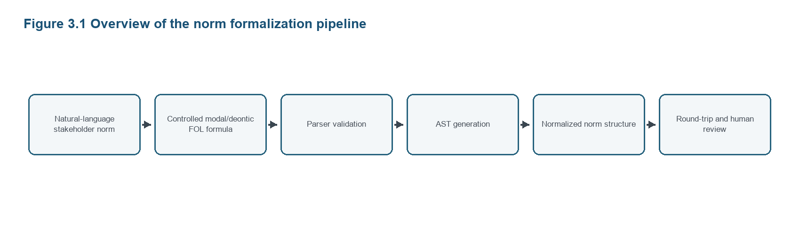
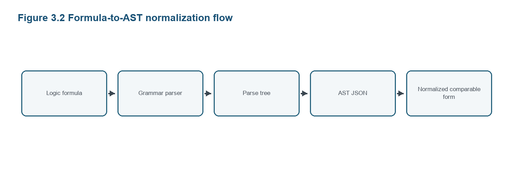
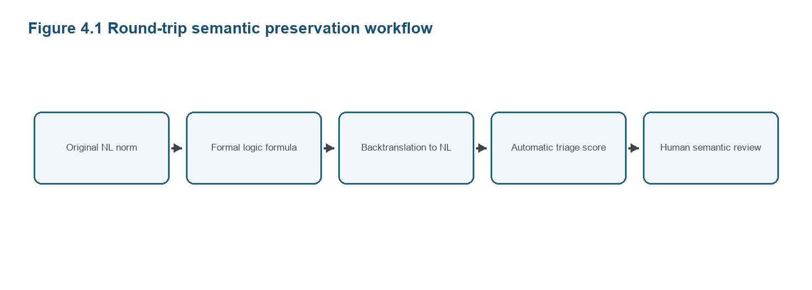
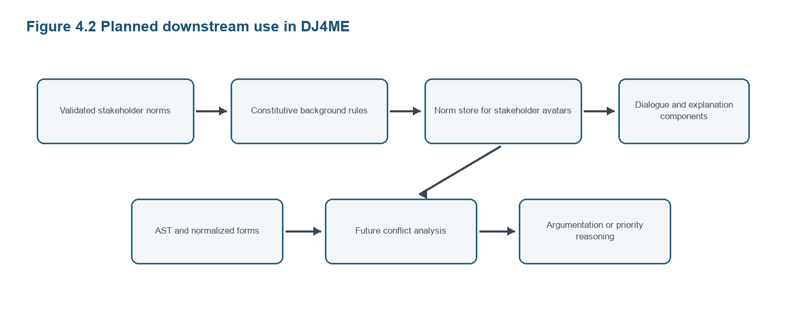

Faculty of Science, Technology and Communication

Leveraging LLMs for Agent-Based Normative Recommender Systems

A Pipeline for Stakeholder Norm Translation, Validation, and Formulation Comparison

Thesis Submitted in Partial Fulfillment of the Requirements for the Degree of Master in Information and Computer Sciences

Author: Nabila Waheed

Supervisor: Prof. Leon van der Torre

Advisor: Matteo Magnini

Reviewer: Reka Markovich

Date: August 2026


# Abstract

Autonomous recommender systems increasingly operate in domains where recommendations are not merely matters of preference optimization, but also involve ethical, legal, health-related, and stakeholder-specific constraints. In food recommendation, for example, a system may need to respect user allergies, religious dietary requirements, public-health restrictions, product-safety rules, and commercial objectives. These requirements are often expressed in natural language, while formal reasoning, parser validation, argumentation, dialogue, and explanation require structured representations.

This thesis investigates how large language models can support the formalization of stakeholder norms for an agent-based normative recommender system. The work is situated in the context of DJ4ME, where stakeholder views may be represented by avatars that reason with norms and participate in machine-ethics dialogue. The thesis translates stakeholder norms into a controlled modal/deontic first-order logic syntax that supports obligations, permissions, prohibitions, implication-based monadic conditional formulations, and dyadic conditional formulations. Three stakeholder perspectives are considered: User, Food Ministry, and Food Industry.

The current implementation constructs a norm translation dataset rather than a recommendation dataset. Each natural-language norm is paired with both an implication-based monadic formulation and a dyadic formulation. This design supports comparison between formalization strategies rather than treating them as interchangeable. Product categories are modeled as predicates over product variables, and the recommendation relation is represented as recommend(System,y,x), where y is the product and x is the target user. Constitutive rules, such as category classifications, are stored separately from stakeholder norms as background domain knowledge.

The pipeline includes grammar-based validation, AST generation, normalized formula representations, and round-trip checks. Using the same controlled grammar and prompt structure, it compares ChatGPT- and Claude-generated datasets. Both achieved zero parser validation errors. Round-trip evaluation and human review show that syntactic validity alone does not ensure semantic faithfulness: Claude produced fewer severe mismatches, while ChatGPT used a broader predicate vocabulary. This provides a reproducible DJ4ME-oriented norm-formalization pipeline.

Keywords: large language models; deontic logic; first-order logic; normative recommender systems; stakeholder norms; grammar validation; abstract syntax trees; round-trip evaluation

# List of Tables

Table 3.1 Dataset schemas and record counts
Table 3.2 Main validation checks
Table 3.3 Round-trip automatic score interpretation
Table 4.1 Dataset output files and purposes
Table 4.2 Parser validation comparison
Table 4.3 Automatic round-trip comparison between ChatGPT baseline and Claude
Table 4.4 Human review comparison between ChatGPT baseline and Claude
Table 4.5 Auto-human crosstab for the ChatGPT baseline
Table 4.6 Auto-human crosstab for Claude
Table 4.7 Human error-type comparison
Table 4.8 Implication-versus-dyadic comparison
Table B.1 Example dataset record
Table C.1 Human evaluation scoring rubric

# List of Figures

Figure 3.1 Overview of the norm formalization pipeline
Figure 3.2 Formula-to-AST normalization flow
Figure 4.1 Round-trip semantic preservation workflow
Figure 4.2 Planned downstream use in DJ4ME

# Table of Contents

1 Introduction
    1.1 Background and Motivation
    1.2 Problem Statement
    1.3 Research Questions
    1.4 Contributions
    1.5 Thesis Structure

2 Literature Review
    2.1 DJ4ME and Machine Ethics
    2.2 Large Language Models and Formalization
    2.3 Natural Language to Logic Translation
    2.4 Deontic Logic and Normative Agents
    2.5 Multi-Stakeholder Recommender Systems
    2.6 Food Recommendation and Constraint-Aware Systems
    2.7 Research Gap

3 Methodology
    3.1 Research Design
    3.2 Dataset Construction
    3.3 Logic Grammar and Formalization Conventions
    3.4 Parser Validation
    3.5 AST Generation and Normalization
    3.6 Round-Trip Semantic Preservation
    3.7 LLM Comparison and Human Semantic Review
    3.8 Scope Boundary and Downstream DJ4ME Use

4 Results and Discussion
    4.1 Dataset Outputs
    4.2 Parser Validation Results
    4.3 AST and Round-Trip Outputs
    4.4 Claude Comparison Results
    4.5 Discussion

5 Conclusion and Future Work
    5.1 Contributions
    5.2 Limitations
    5.3 Future Work

Bibliography

Appendix A: Repository and Reproducibility
Appendix B: Example Dataset Record
Appendix C: Human Evaluation Form

# Chapter 1: Introduction

## 1.1 Background and Motivation

Artificial intelligence systems are increasingly deployed in settings where their outputs influence the choices, wellbeing, and rights of human users. Recommender systems are a central example of this development. They shape what users see, consume, buy, and consider relevant. In many applications, recommendation quality is usually discussed in terms of accuracy, personalization, engagement, or utility. However, when recommendations concern sensitive domains such as food, health, wellbeing, or lifestyle, purely preference-based optimization is insufficient. A recommendation can be technically relevant while still being inappropriate, unsafe, unfair, or normatively unacceptable.

Food recommendation provides a useful case study because the domain naturally contains many kinds of normative constraints. A user may require halal, kosher, vegan, gluten-free, lactose-free, low-sugar, or low-salt food. A child should not receive recommendations for energy drinks or age-restricted products. A person with an allergy should not receive food containing a harmful ingredient. A food ministry may require labeling, safety warnings, and protection of vulnerable users. Food industry actors may want to promote certified, sponsored, seasonal, or available products, while still respecting safety and compliance constraints. These concerns cannot be reduced to a single preference score.

The food domain also makes the difference between ordinary preferences and norms especially visible. A preference such as liking spicy food can often be traded off against other ranking criteria. A medical allergy, a religious dietary restriction, a child-safety prohibition, or a regulatory labeling requirement is different. Such requirements are not merely weak signals about taste; they constrain what the system should, may, or must not recommend. This distinction matters for recommender systems because a high predicted click-through rate or satisfaction score cannot by itself justify a recommendation that violates a safety, health, ethical, or regulatory norm.

Normative requirements in this domain also come from more than one source. The individual user is only one stakeholder. Public-health actors may define constraints intended to protect vulnerable users or ensure truthful labeling. Food industry actors may have commercial norms related to availability, certification, sponsorship, seasonal placement, or compliance. These stakeholder positions are not always reducible to a single utility function. Representing them separately is therefore useful for later dialogue, explanation, and argumentation, even if the present thesis does not implement a full recommender or conflict-resolution system.

The DJ4ME project, A DJ for Machine Ethics: the Dialogue Jiminy, motivates this thesis. DJ4ME investigates how autonomous agents can make ethically relevant decisions by representing stakeholder perspectives through dialogue and argumentation. The project builds on the idea that affected stakeholders may be represented by avatars embedded in or connected to the agent. These avatars can hold norms, make arguments, and participate in dialogue about what the agent should do. In contrast to a purely automatic moral advisor that aggregates stakeholder norms internally, Dialogue Jiminy aims to preserve stakeholder autonomy by allowing avatars to participate in persuasion dialogue.

The DJ4ME proposal identifies a natural-language interface as one of the core requirements for such a system. This interface is expected to support both norm mining and explanation synthesis. Norm mining and norm formalisation concern the transformation of informal stakeholder norms into formal rules usable by avatars. Explanation synthesis concerns the reverse direction: making formal recommendations or dialogues understandable in plain natural language. This thesis focuses on the first part of that interface: translating stakeholder norms from natural language into a controlled modal/deontic first-order logic syntax that supports obligations, permissions, prohibitions, implication-based monadic conditional formulations, and dyadic conditional formulations.

Large language models are promising for this task because they are capable of interpreting natural-language rules and producing structured symbolic expressions. At the same time, LLMs are not guaranteed to produce valid formulas or semantically faithful translations. They may invent predicates, mix notation styles, omit variables, or produce formulas that look plausible but cannot be parsed. This thesis therefore studies LLM-based norm formalization as part of a controlled pipeline that combines natural-language generation, fixed grammar validation, AST generation, round-trip semantic checks, LLM comparison, and human semantic review.

This choice of a controlled pipeline is important. The thesis does not assume that an LLM output is correct because it is fluent, and it does not treat parser validity as sufficient evidence of semantic correctness. Instead, each stage answers a narrower question. Grammar validation asks whether a formula belongs to the intended formal language. AST generation asks whether the internal structure can be inspected and reused programmatically. Round-trip backtranslation asks whether the formal representation still expresses the practical meaning of the original norm. Human semantic review then checks a sample of cases where automatic scoring may be too coarse or misleading.

The contribution is therefore best understood as an upstream language-interface and dataset contribution. It prepares stakeholder norms for possible later reasoning by making them explicit, validated, and structurally comparable. It does not yet decide which stakeholder should prevail in a conflict, calculate recommendations for actual users, or connect formulas to a deployed product database. Those tasks require additional reasoning architecture, domain data, and possibly argumentation semantics. The present thesis focuses on the prior question: whether LLM-assisted translation can produce usable formal norm representations under controlled assumptions.

The practical motivation for this upstream focus is that later reasoning components are only as reliable as the representations they consume. If stakeholder norms are informal, inconsistent, or ambiguously encoded, a downstream argumentation module may produce results that appear formally precise while resting on unstable inputs. A validated translation layer reduces this risk by making modeling assumptions explicit before reasoning begins. This is particularly important in ethically sensitive recommendation domains, where an explanation should be able to refer back to an identifiable stakeholder norm rather than to an opaque score.

## 1.2 Problem Statement

Stakeholder norms are often available in natural language, but agent-based normative reasoning and dialogue require formal representations. The central problem is how to translate stakeholder norms into formulas in a controlled modal/deontic first-order logic syntax that supports obligations, permissions, prohibitions, implication-based monadic conditional formulations, and dyadic conditional formulations, while keeping the formulas syntactically valid, semantically meaningful, and reusable by downstream DJ4ME components. This problem is made more difficult by the fact that conditional norms can be represented in different formal styles. In particular, implication-based monadic norms and dyadic norms have different semantic interpretations and should not be treated as interchangeable.

A second modeling problem concerns product categories. Early versions of the dataset used expressions such as recommend(System,EnergyDrink), where a category such as EnergyDrink was treated as a constant. This is problematic because a constant denotes a particular object in a model rather than a class of products. The revised design instead quantifies over product variables and represents categories as predicates, such as energyDrink(y). This makes the formalization more suitable for a single domain model containing many products.

A third problem concerns redundancy. Some norms should not be repeated for every specific food category if broader constitutive classifications can be used. For example, shellfish meals, meat meals, dairy meals, and egg meals can be classified as non-vegan through background rules. A general user norm can then prohibit recommendations of non-vegan products to vegan users. The thesis therefore separates normative stakeholder rules from constitutive domain rules.

These three problems are connected. If product categories are represented incorrectly, the resulting formulas are harder to interpret over a real product domain. If constitutive rules are mixed with stakeholder norms, the dataset becomes repetitive and conceptually unclear. If implication-based and dyadic conditional forms are mixed without being paired, the evaluation cannot distinguish differences caused by the formula style from differences caused by the underlying natural-language norm. The revised dataset design is intended to address these modeling issues before any downstream reasoning or dialogue component is attempted.

The problem statement also implies a methodological challenge for evaluating LLM outputs. A formula can be syntactically valid while still being a poor translation of the original norm. Conversely, a formula can preserve the intended meaning but use a different predicate vocabulary from another valid dataset. The thesis therefore evaluates the outputs from several angles: parser validity, structural representation, round-trip semantic preservation, human review, and comparison between two LLM-generated datasets.

A further challenge is that there is no single gold-standard formalization for many conditional norms. Reasonable formalizers may disagree about predicate names, the granularity of conditions, whether a condition should be represented inside or outside a modal operator, and how much background knowledge should be included directly in the norm. This thesis does not try to eliminate all such choices. Instead, it makes the choices visible and consistent enough to support comparison. The dataset should therefore be read as a controlled formalization artifact, not as the only possible formal representation of stakeholder food norms.

## 1.3 Research Questions

The main research question is:

How can large language models support the translation, validation, and analysis of stakeholder norms for agent-based normative recommender systems?

The thesis is guided by the following sub-questions:

1. How accurately can LLMs translate stakeholder norms from natural language into formulas in a controlled modal/deontic first-order logic syntax?

1. To what extent do generated formulas satisfy the syntax of a controlled grammar?

1. To what extent do generated formulas preserve the meaning of the original natural-language norm under round-trip translation?

1. How do implication-based monadic formulations and dyadic formulations compare in terms of syntax validity, AST structure, and semantic preservation?

1. How reliable is automatic round-trip evaluation when compared with human semantic review?

The fourth sub-question is motivated by the fact that conditional stakeholder norms can be formalized in more than one plausible way. For example, a norm such as "children should not receive energy drink recommendations" can be represented as an implication-based formula, where the condition implies a monadic prohibition, or as a dyadic formula, where the prohibition is conditional on the relevant user and product properties. The thesis does not assume that these two forms are semantically identical. Instead, it treats them as alternative formalization strategies whose behavior can be compared under controlled conditions.

The fifth sub-question reflects the limits of automatic evaluation. The round-trip evaluator can identify many likely preservation failures by comparing key concepts and modality markers, but it cannot fully understand every stakeholder-specific nuance. For example, it may judge a backtranslation as close because the main predicates are present, even if the wording weakens a legal or safety condition. It may also be conservative when the wording changes but the practical norm is still equivalent. Human review is therefore used to calibrate how much confidence should be placed in the automatic scores.

## 1.4 Contributions

- A revised stakeholder norm dataset design for User, Food Ministry, and Food Industry perspectives.

- A paired formalization strategy in which each natural-language norm has both implication-based and dyadic formulas.

- A corrected modeling convention that represents product categories as predicates over quantified product variables.

- A separate constitutive-rule dataset for background domain classifications.

- A reproducible parser-validation and AST-generation pipeline.

- A round-trip semantic preservation workflow with automatic triage scores and human-evaluation results.

- A comparison between a baseline LLM-generated dataset and a Claude-generated dataset produced from the same prompt structure.

Together, these contributions provide both an artifact and an evaluation procedure. The artifact consists of validated stakeholder and constitutive-rule datasets, prompt files, grammar, scripts, AST outputs, round-trip outputs, and comparison reports. The procedure shows how LLM-generated formalizations can be checked and compared without relying on fluency alone. This is important for DJ4ME because stakeholder avatars would require explicit and inspectable rules before they could participate in dialogue or argumentation about ethically relevant recommendations.

The contribution is also methodological because it demonstrates how relatively small generated datasets can still support meaningful analysis when the evaluation artifacts are preserved. The thesis does not depend only on a final CSV file. It stores the prompts, validation script, grammar, AST outputs, automatic round-trip scores, human review summary, and comparison reports. This makes the work easier to audit and easier to extend. A future researcher can inspect where a formula came from, how it was validated, how it was backtranslated, and how it contributed to the reported aggregate results.

## 1.5 Thesis Structure

Chapter 2 reviews related work on DJ4ME, LLM-based formalization, natural-language-to-logic translation, deontic logic, normative agents, multi-stakeholder recommender systems, and food recommendation. Chapter 3 presents the methodology, including dataset construction, grammar design, parser validation, AST generation, round-trip evaluation, LLM comparison, and human semantic review. Chapter 4 reports current implementation results and discusses their implications. Chapter 5 concludes the thesis by summarizing contributions, limitations, and future work.

# Chapter 2: Literature Review

## 2.1 DJ4ME and Machine Ethics

The DJ4ME project provides the research context for this thesis. It studies machine ethics for autonomous agents whose decisions may affect multiple stakeholders [0]. The proposal connects machine ethics with deontic logic, normative systems, formal argumentation, argumentation as dialogue, and machine learning. Formal argumentation is relevant because abstract argumentation frameworks provide a way to evaluate competing arguments and attacks between them [7]. DJ4ME's central architectural idea is that stakeholders can be represented by avatars. These avatars can hold norms and participate in reasoning or dialogue about what an autonomous agent should do.

DJ4ME builds on the Autonomous Jiminy architecture, where stakeholder norms can be combined into arguments in order to identify moral dilemmas and recommend actions to the agent. The Dialogue Jiminy extension shifts the focus toward persuasion dialogue between stakeholder avatars. This is important because it gives stakeholders more control over how their norms are used in the moral recommendation process.

The proposal identifies a natural-language interface as a key part of the project. This interface includes norm mining, norm formalisation, and explanation synthesis. Norm formalisation is the part most relevant to this thesis: informal stakeholder norms must be converted into formal rules that can be validated and used by avatars or reasoning components. The thesis contributes to this upstream formalisation task by constructing and evaluating a pipeline for translating stakeholder food-recommendation norms into formulas in a controlled modal/deontic first-order logic syntax.

The DJ4ME framing is useful because it places formalization inside a broader interaction model. The goal is not merely to store a rule in a database, but to make stakeholder positions available for later deliberation. If an avatar is expected to argue that a recommendation should be avoided, promoted, or explained, then its norm must be represented in a form that exposes the relevant action, modality, and condition. A natural-language sentence may be understandable to a human reader, but a dialogue or argumentation component needs a more explicit representation.

The thesis therefore treats formalization as an enabling layer for future autonomy-preserving interaction. In a Dialogue Jiminy-style system, stakeholders should not disappear into a single opaque optimization function. Their views should remain identifiable as stakeholder-specific rules that can be compared, questioned, and explained. Separating User, Food Ministry, and Food Industry norms in the dataset is a small-scale implementation of this principle.

This thesis also draws from DJ4ME's distinction between norm mining and explanation synthesis. Norm mining moves from informal stakeholder language to formal rules. Explanation synthesis moves in the opposite direction, from formal reasoning results back to human-readable language. The round-trip method used in this thesis connects these two directions at a limited scale. It does not implement full explanation synthesis, but it uses backtranslation as a way to test whether formalized norms can still be expressed intelligibly in natural language.

## 2.2 Large Language Models and Formalization

Large language models have demonstrated strong abilities in natural-language understanding, text generation, summarization, and code-like symbolic output. These capabilities make them attractive for translating informal requirements or norms into formal languages. Recent work on LLM-assisted logical reasoning has explored this direction by coupling language models with symbolic solvers or formal representations [3]. However, LLMs also introduce risks. They may produce syntactically invalid expressions, hallucinate predicates, collapse distinctions that matter semantically, or generate outputs that are fluent but not faithful to the source. In formalization tasks, these errors are especially important because small notation changes can alter the meaning of a formula.

For this thesis, LLMs are not treated as standalone reasoners. Instead, they are treated as components in a hybrid pipeline. The LLM can assist in producing candidate formalizations, but the output must be checked by a grammar and parser before it is used for reasoning. This follows a broader direction in neurosymbolic AI: using language models for flexible linguistic interpretation while relying on formal tools for validation and structured reasoning. Logic-LM, for example, uses LLMs together with symbolic solvers for logical reasoning, which illustrates the general motivation for separating natural-language interpretation from formal checking [3].

This hybrid role is especially important in formalization tasks. LLMs are useful because they can interpret varied natural-language expressions and produce structured symbolic candidates without requiring every norm to be hand-coded from scratch. However, the same flexibility creates risk. A model can produce an expression that looks logically sophisticated while violating the intended grammar or silently changing the scope of a condition. The parser and validation scripts therefore act as a boundary between plausible text generation and accepted formal data.

The use of LLMs also raises reproducibility questions. Outputs can vary with model version, prompt wording, temperature, effort setting, and chat context. This thesis addresses reproducibility by storing the prompt files, generated datasets, validation scripts, and comparison outputs. It also records the Claude metadata and the ChatGPT baseline metadata: ChatGPT 5.5 with medium effort. This documentation is important because a future replication may not produce identical rows even when using the same prompt structure.

The pipeline therefore uses LLMs as generators of candidate structured data, not as authorities. This distinction affects how the results are interpreted. A high validation score does not mean that the model understands deontic logic in a human-like way. It means that the generated artifacts satisfy the grammar and modeling checks defined by the thesis. Similarly, a good round-trip score does not prove deep semantic understanding. It indicates that the generated formula can be transformed back into a controlled natural-language expression that preserves key features of the source norm.

## 2.3 Natural Language to Logic Translation

Work on natural-language-to-first-order-logic translation is directly relevant to this thesis. Semantic parsing research has long studied the conversion of natural-language utterances into executable or logical forms, and recent surveys describe a movement from rule-based systems toward neural and program-synthesis approaches [9]. The LOGICLLAMA line of work studies how LLMs can translate natural language into first-order logic and emphasizes dataset generation, prompt design, grammar verification, and correction strategies [1]. Such work shows that LLMs can be useful for formal translation tasks, but also that generated formulas require validation and that silver-label datasets should be handled carefully.

FOLIO is another relevant reference because it provides natural-language statements paired with first-order logic annotations [2]. It demonstrates the value of formal annotations for reasoning tasks and highlights the importance of carefully checked logical representations. More recent neurosymbolic work, such as compositional FOL translation and verification, also points to the value of decomposing natural-language reasoning tasks into formal translation and formal checking stages [10]. However, these works focus on general first-order logic rather than deontic or modal norms.

This thesis differs from standard NL-to-FOL work by focusing on a controlled modal/deontic first-order logic syntax for stakeholder norms. The target formulas contain obligations, permissions, prohibitions, implication-based conditional formulas, and dyadic conditional formulas. The immediate goal is not to build a complete moral dialogue system, but to evaluate whether LLM-generated stakeholder norms can be expressed in a controlled formal language with valid syntax and preserved meaning.

Another difference is the type of meaning that must be preserved. In many NL-to-FOL datasets, the central issue is whether a statement can support truth-conditional inference. In this thesis, the central issue is normative: whether a sentence about what should, may, or must not be recommended is translated without changing its deontic force. Losing the difference between permission and obligation, or between a forbidden action and a forbidden product property, can change the role of the norm in later reasoning.

The thesis also differs from general NL-to-FOL work by pairing two formalizations for the same natural-language conditional norm. This is not a standard dataset-generation choice. It is introduced here because conditional deontic statements are theoretically sensitive: placing the condition outside the modal operator is not the same modeling choice as placing the condition inside a dyadic deontic operator. Pairing both versions makes this issue visible and measurable in the implementation.

The relevance of NL-to-FOL work is therefore both technical and cautionary. It shows that LLMs can produce useful formal representations, but it also shows that generated logic datasets must be handled carefully. This thesis adopts that lesson by treating its datasets as generated artifacts requiring validation, rather than as automatically correct annotations. The additional modal/deontic layer makes this caution even more important because mistakes in modality can change a recommendation from permitted to obligatory or forbidden.

## 2.4 Deontic Logic and Normative Agents

Deontic logic provides formal tools for representing normative concepts such as obligation, permission, and prohibition. In normative multi-agent systems, deontic concepts are commonly used to describe how agents should, may, or must not behave [11, 12]. In this thesis, the operators O, P, and F are used to represent these modalities. Conditional norms can be represented using implication-based formulas, such as X->O(Y), or dyadic formulas, such as O(Y|X). These forms are not treated as semantically identical. The thesis therefore keeps both forms paired for the same natural-language norm in order to support comparison.

Normative agent research is also relevant because autonomous agents may need to reason about what they are permitted, required, or forbidden to do. Norm conflicts are a central challenge in this area. A system may face one norm requiring an action and another norm prohibiting the same action under overlapping conditions. Literature on normative conflict detection and resolution in multi-agent systems shows that conflicts require additional mechanisms beyond the representation of single norms, such as priorities, exception handling, argumentation, or other conflict-resolution strategies [6, 13]. In this thesis, conflict handling is treated as a downstream DJ4ME use case rather than as an implemented component. The implemented focus is the formalisation and evaluation of the norms that such a component would later require.

This distinction between formalizing, detecting, and resolving conflicts is important. Formalizing a norm means representing its modality, action, and condition in a structured language. Detecting a conflict would require comparing two or more formalized norms and identifying incompatible modalities over overlapping actions and conditions. Resolving a conflict would require an additional theory of priority, exception, authority, stakeholder weight, or argument acceptability. The present thesis contributes mainly to the first step and prepares artifacts that could support the second.

Dyadic deontic formulations are relevant here because many real norms are conditional. A food item may be permitted for one user and forbidden for another; a recommendation may be obligatory only when a health condition and product property both hold. Conditionality is therefore not a minor syntactic detail. It determines the circumstances under which a norm applies, and it affects how a future agent might identify overlapping or conflicting cases.

The thesis does not choose between implication-based and dyadic formulations as a final theoretical position. Instead, it treats the two forms as alternative encodings that can be compared under the same dataset and evaluation procedure. This is a pragmatic choice. A full semantic analysis of conditional deontic logic and multi-agent deontic logic would require more theoretical machinery than the implemented pipeline provides [14]. However, ignoring the difference would also be problematic. The paired design gives the thesis a way to acknowledge the theoretical issue while still producing concrete implementation results.

## 2.5 Multi-Stakeholder Recommender Systems

Multi-stakeholder recommender systems recognize that recommendations affect more than one party. A recommendation may benefit a user, a provider, a platform, a regulator, or a broader public interest. Research on multi-stakeholder recommendation and multi-sided fairness shows that recommender systems may need to balance competing objectives and constraints across different actors [4, 5].

The stakeholder framing is central to this thesis. User norms represent individual needs and constraints, Food Ministry norms represent public-health and regulatory concerns, and Food Industry norms represent commercial and product-placement objectives. The thesis formalizes these perspectives separately so that downstream DJ4ME components could later compare stakeholder positions in argumentation or dialogue.

This separation also avoids treating "the recommender system" as if it had only one objective. In a conventional recommender evaluation, the system may be assessed mainly by prediction accuracy, ranking quality, or user engagement. In a multi-stakeholder setting, a recommendation may simultaneously affect user safety, regulatory compliance, provider interests, and public trust. Constraint-based and knowledge-based recommender-system research is relevant here because it shows that recommendation can be guided by explicit constraints and domain knowledge rather than only by collaborative or content-similarity signals [15]. A formal norm dataset can make these dimensions explicit by showing which stakeholder perspective gives rise to which obligation, permission, or prohibition.

The three stakeholder groups used here are a simplification, but they are useful for implementation. The User perspective captures personal and individual constraints, the Food Ministry perspective captures public-health and regulatory constraints, and the Food Industry perspective captures commercial and product-related constraints. A larger DJ4ME deployment could include more stakeholder categories, but the three-way structure is sufficient for testing whether LLM-generated norms can be formalized consistently across different kinds of normative vocabulary.

This structure also produces different kinds of norms. User norms often concern individual requirements, such as dietary restrictions, allergies, medical conditions, and personal ethical commitments. Food Ministry norms more often concern public protection, labeling, safety, and vulnerable groups. Food Industry norms include norms about certified products, availability, sponsorship, and market placement. These differences make the dataset more useful than a single-stakeholder dataset because the formalization pipeline must handle a broader range of conditions and modalities.

## 2.6 Food Recommendation and Constraint-Aware Systems

Food recommendation is often discussed in relation to personalization, nutrition, health, dietary constraints, and recipe retrieval. Surveys of food recommender systems show that the domain is diverse and technically challenging because recommendations may depend on user preferences, nutritional requirements, ingredients, recipes, health goals, and contextual factors [16, 17]. Constraint-aware food recommendation systems and food knowledge graphs show that food recommendations may depend on structured information about ingredients, dietary labels, allergens, and user requirements [8]. This thesis does not build a complete food knowledge graph, but it uses a similar idea at the logical level: predicates such as glutenFreeMeal(y), contains(y,Nuts), highSugarProduct(y), and certifiedHalal(y) represent product properties that a domain model could later interpret.

The food domain is therefore suitable as a case study for normative recommendation. It contains personal preferences, safety constraints, religious requirements, medical needs, regulatory obligations, and commercial interests. Health and nutrition recommender-system reviews also show that evaluation is difficult because such systems may need to consider not only technical recommendation accuracy but also health relevance, user characteristics, explanation, and real-world impact [18]. These properties make food recommendation a rich setting for studying stakeholder norm formalization.

The domain also provides intuitive examples for evaluating translation quality. A reader can usually understand why a child should not receive energy drink recommendations, why a user with a nut allergy should avoid products containing nuts, or why a product making a health claim may require appropriate labeling. This makes the round-trip evaluation more interpretable: when a backtranslation loses a condition, weakens a prohibition, or changes the target user, the error can be explained in ordinary language.

At the same time, the thesis does not attempt to model all nutritional knowledge. It does not construct a full ontology of ingredients, recipes, products, brands, certifications, or medical conditions. Instead, it uses predicate names as formal placeholders for properties that a future domain model could interpret. This is consistent with the thesis scope: the focus is on norm translation and validation, not on building a complete food knowledge graph.

This placeholder approach has both advantages and limitations. It allows the thesis to focus on formula structure without requiring a complete domain ontology, but it also means that predicate meanings are only controlled by naming conventions and natural-language context. For example, predicates such as `highSugarProduct(y)` or `certifiedHalal(y)` are meaningful to a reader, but the repository does not define their extension over a real product database. This is why the thesis treats domain interpretation as future work.

## 2.7 Research Gap

Existing work studies LLM-based logic translation, normative agents, deontic reasoning, multi-stakeholder recommendation, and food recommendation. However, there is limited work combining these directions into a reproducible pipeline for translating stakeholder food-recommendation norms into formulas in a controlled modal/deontic first-order logic syntax that supports obligations, permissions, prohibitions, implication-based monadic conditional formulations, and dyadic conditional formulations; validating those formulas with a parser; generating ASTs; comparing LLM-generated datasets; and evaluating round-trip semantic preservation with human review. This thesis addresses that gap by building and evaluating such a pipeline in a focused case study aligned with the DJ4ME language-interface objective.

# Chapter 3: Methodology

## 3.1 Research Design

The research follows an implementation-oriented design. The objective is to construct a reproducible pipeline that takes stakeholder norms in natural language and produces validated formulas in a controlled modal/deontic first-order logic syntax that supports obligations, permissions, prohibitions, implication-based monadic conditional formulations, and dyadic conditional formulations. These formulas are suitable for AST generation, semantic checking, LLM comparison, and later use by DJ4ME components. The dataset is not a recommendation dataset, and the pipeline is not intended to produce food recommendations directly. Instead, it supports the upstream language-interface task of formalizing norms that could later be used by stakeholder avatars or normative reasoning components.

The work is structured around three stakeholder perspectives: User, Food Ministry, and Food Industry. For each stakeholder, norms are expressed in natural language and formalized using two alternative conditional structures. The resulting formulas are validated against a fixed grammar, parsed into ASTs, normalized into comparable structures, and used for round-trip backtranslation.

Figure 3.1 gives the conceptual pipeline.



Figure 3.1. Overview of the norm formalization pipeline.

The methodology is designed around traceability. Each dataset row keeps the natural-language norm together with its two formal representations, which makes it possible to inspect a translation error without searching across unrelated files. The scripts then produce derived artifacts rather than replacing the source data: validation reports, AST JSON files, round-trip backtranslations, evaluated round-trip rows, and comparison reports. This makes the pipeline reproducible and makes it easier to identify which stage produced a particular result.

The implementation also uses conservative scope boundaries. It does not attempt to prove that the formulas are correct in a fully specified model, because no complete product catalog or model interpretation is included. Instead, it checks the properties that can be evaluated within the repository: schema consistency, grammar validity, structural conventions, formula-type markers, AST shape, round-trip preservation, and human semantic review. These checks are sufficient for evaluating the dataset as a norm translation artifact, while leaving full reasoning and deployment for future work.

The research design can be described as iterative and artifact-driven. The early design exposed modeling problems, especially around product categories and recommendation arity. The revised design then corrected these problems and encoded the corrections in prompts, grammar assumptions, and validation checks. This makes the methodology more than a one-time generation exercise. It is a cycle in which modeling assumptions are revised, operationalized in scripts, and then tested against the generated datasets.

The artifact-driven approach also affects how success is defined. The thesis does not evaluate success by asking whether the pipeline produces a working deployed recommender. Instead, it evaluates whether the repository contains a coherent set of artifacts that could be inspected and reused: datasets, prompts, grammar, scripts, validation outputs, AST outputs, round-trip outputs, human review summaries, and comparison reports. This is appropriate for an upstream thesis because the main deliverable is a validated formalization layer.

The methodology also emphasizes repeatability over one-off manual correction. Manual correction could improve individual formulas, but it would make it harder to evaluate the generation and validation process itself. For this reason, the Claude datasets are explicitly described as generated using the saved prompt files without manual edits. The goal is to understand what the prompt-and-validation pipeline can produce, and where human review is still required, rather than to quietly repair errors without recording them.

## 3.2 Dataset Construction

The dataset is a norm translation dataset. Each stakeholder record contains a natural-language norm and two formal representations of that norm. The revised stakeholder schema is shown in Table 3.1. The key design decision is that implication-based and dyadic formulas are paired within the same record rather than stored as unrelated records. This allows the thesis to compare the two formalization strategies for the same natural-language content.

The original motivation for using both formulations was to avoid making a premature theoretical commitment to one representation of conditional norms. Implication-based formulas and dyadic deontic formulas are both common ways of expressing conditional normative statements, but they differ in how the condition is placed. In an implication-based formulation, the condition is outside the modal operator, as in X->O(Y). In a dyadic formulation, the condition is part of the modal expression itself, as in O(Y|X). Since these forms have different logical interpretations, the dataset pairs them for each natural-language norm instead of treating them as interchangeable duplicates.

Table 3.1. Dataset schemas and record counts.

| Dataset | Schema | Current size |
| --- | --- | --- |
| Stakeholder norms | id, stakeholder, nl_norm, implication_formula, dyadic_formula, norm_type | 300 records |
| Constitutive rules | id, scope, nl_rule, logic_rule, category | 50 records |
| Total | Main norms plus background rules | 350 records |

The User dataset contains norms concerning dietary requirements, allergies, medical conditions, religious diets, ethical preferences, affordability, taste, and avoidance constraints. The Food Ministry dataset contains norms related to public health, vulnerable users, nutrition thresholds, safety warnings, labeling, approval, and restricted products. The Food Industry dataset contains norms related to sponsored products, certified products, market placement, availability, seasonal products, premium users, and compliance constraints.

Each stakeholder dataset contains 100 records. This size is large enough to test the grammar and pipeline across varied predicates and conditions, but small enough for manual inspection and human semantic review to remain feasible. For every natural-language norm, the dataset stores an implication formula and a dyadic formula. The `norm_type` field records whether the main modality is obligation, permission, or prohibition. This allows later aggregation by stakeholder, formulation type, and modality.

The constitutive-rule dataset contains 50 records. These records are not stakeholder norms because they do not state what the system should, may, or must not recommend. Instead, they state background classifications, such as one category counting as another or a product property implying a broader class. Keeping these rows in a separate file prevents the stakeholder datasets from becoming cluttered with repeated domain facts and makes it clear which formulas are normative and which are classificatory.

The dataset-generation prompts are stored in the `prompts` folder so that the generation setup remains inspectable. The prompts specify the schema, grammar expectations, stakeholder perspective, and modeling conventions. This is important because the dataset should not be treated as an unexplained collection of formulas. It is the output of a controlled generation procedure, and the prompts are part of the reproducibility record.

The baseline and Claude datasets are also useful as two independent generated samples under the same overall design. They are not expected to contain the same natural-language rows, and exact overlap is therefore not the main criterion. Instead, the comparison asks whether both generated datasets can satisfy the same formal constraints and whether their differences reveal meaningful variation in vocabulary, norm-type distribution, or formula structure. This helps distinguish the robustness of the pipeline from the specific style of one model's generated content.

The prompt files play a similar role to an experimental protocol. They state the schema and modeling rules that the LLM is expected to follow. Because the prompts are included in the repository, the dataset is not separated from the instructions that generated it. This matters for evaluating LLM-based work: if the prompt is unavailable, it is difficult to know whether a result reflects model capability, prompt engineering, or undocumented manual intervention.

The dataset construction process also balances diversity and control. Too much control would produce repetitive formulas that trivially pass validation but do not test the pipeline across varied conditions. Too little control would produce inconsistent notation and make validation difficult. The stakeholder-specific prompts are intended to create diversity in natural-language norms and predicates while keeping the formal schema, quantifier conventions, modality markers, and recommendation relation stable.

### 3.2.1 Product Variables and Predicates

Product categories are modeled as predicates over product variables rather than constants. This means that a category such as gluten-free meal is represented as glutenFreeMeal(y), where y ranges over products. The recommendation relation is represented as recommend(System,y,x), where y is the product and x is the target user. This design avoids treating product categories as single objects and makes the formulas more suitable for interpretation over a product domain.

∀x.∀y.requiresGlutenFree(x)∧glutenFreeMeal(y)∧certifiedGlutenFree(y)->P(recommend(System,y,x))

This convention is important because a recommender system normally selects among many concrete items. If `EnergyDrink` is treated as a constant inside `recommend(System,EnergyDrink)`, the formula does not clearly distinguish between a product category and an individual product. By quantifying over `y`, the formula can be read as applying to any product that satisfies the predicate `energyDrink(y)`. This is closer to how a product catalog, ontology, or knowledge base would later represent food items.

The target user is also explicit in the recommendation relation. A recommendation is not only an action involving a product; it is an action directed toward a particular user. The expression `recommend(System,y,x)` therefore records the system, product, and target user. This makes it possible to represent user-specific conditions such as `child(x)`, `diabetic(x)`, or `requiresGlutenFree(x)` alongside product-specific predicates such as `energyDrink(y)` or `lowSugarFood(y)`.

This convention also supports future explanation. If a recommendation is forbidden because `child(x)` and `energyDrink(y)` both hold, an explanation can mention the relevant user condition and product property. A formula that only says `recommend(System,EnergyDrink)` would make such an explanation less precise because it does not identify the target user or quantify over product instances. The revised relation therefore improves both formal clarity and eventual explainability.

The variable convention also clarifies how user and product conditions interact. User predicates apply to `x`, product predicates apply to `y`, and the recommendation action connects both variables. This makes formulas easier to read and easier to check programmatically. For instance, a malformed formula that applies a product predicate to `x` or omits `y` from the recommendation action can be identified as suspicious even if it happens to parse. Stable variable roles therefore support both human readability and automated validation.

### 3.2.2 Constitutive Rules

Constitutive rules are separated from stakeholder norms. They define background classifications rather than obligations, permissions, or prohibitions. For example, shellfishMeal(y)->nonVegan(y) states that shellfish meals count as non-vegan products. Such rules can reduce redundancy because several specific food categories can be mapped to broader classes used by stakeholder norms.

∀y.shellfishMeal(y)->nonVegan(y)

This separation follows the distinction between normative and constitutive content. A stakeholder norm might say that vegan users should not receive recommendations for non-vegan products. A constitutive rule can then specify that shellfish meals, meat meals, dairy meals, or egg meals count as non-vegan. The norm remains general, while the constitutive rules provide domain knowledge that can support the application of the norm.

The separation also makes the dataset easier to extend. If a new food category is added later, it may be enough to add a constitutive rule connecting the category to an existing predicate. The stakeholder norm does not need to be duplicated for every category. This improves maintainability and reduces the risk that the dataset contains many near-identical norms that differ only by product category.

In the context of DJ4ME, constitutive rules can be viewed as background knowledge that supports avatar reasoning without being attributed to a stakeholder as a preference or obligation. This matters because a dialogue between stakeholders should distinguish between a stakeholder's normative position and a domain fact used to apply that position. For example, a user norm may prohibit non-vegan recommendations, while background rules determine whether a particular product counts as non-vegan.

This distinction also helps avoid a common source of redundancy in norm datasets. Without constitutive rules, the dataset might need separate user norms for shellfish meals, beef meals, dairy meals, egg meals, and other non-vegan categories. With constitutive rules, these categories can be mapped to `nonVegan(y)`, and the stakeholder norm can remain general. This is closer to how formal systems often separate policy-like rules from taxonomic or classificatory knowledge.

## 3.3 Logic Grammar and Formalization Conventions

The target language is a controlled modal/deontic first-order logic syntax. It supports universal and existential quantifiers, predicates, terms, conjunction, disjunction, negation, implication, and modal operators for obligation, permission, and prohibition. The grammar is implemented in Lark and stored in grammar/grammar.lark. All formulas in the revised datasets are validated against this grammar.

The term "controlled" is important. The thesis does not claim to implement every feature of modal logic, deontic logic, or first-order logic. Instead, it defines a restricted syntax that is expressive enough for the dataset and strict enough to be parsed consistently. This restriction is methodologically useful because it prevents the LLM from mixing notation styles or introducing unsupported operators while still allowing common normative patterns.

- O(...) represents obligation.

- P(...) represents permission.

- F(...) represents prohibition.

- X->O(Y), X->P(Y), and X->F(Y) represent implication-based monadic conditional norms.

- O(Y|X), P(Y|X), and F(Y|X) represent dyadic conditional norms.

Example formalizations for the same natural-language norm are:

NL: Children should not receive energy drink recommendations.
Implication: ∀x.∀y.child(x)∧energyDrink(y)->F(recommend(System,y,x))
Dyadic: ∀x.∀y.F(recommend(System,y,x)|child(x)∧energyDrink(y))

This design is based on several assumptions. First, the same natural-language conditional norm can often be given both an implication-based and a dyadic formalization. Second, the two formulations are not assumed to be logically equivalent; they are treated as rival or alternative representations of conditional normativity. Third, LLMs may handle the two forms differently, either syntactically or semantically. Fourth, ASTs can expose structural differences that are not visible from parser validity alone. Finally, round-trip backtranslation can provide an approximate test of whether the practical meaning of the norm is preserved in each formulation.

The formalization conventions also impose a shared quantifier pattern for stakeholder norms. Stakeholder formulas normally begin with universal quantification over users and products, written as `∀x.∀y.`. Constitutive rules quantify over products with `∀y.`. This convention simplifies validation and comparison because the variables have stable roles across the dataset. It also reduces ambiguity in formulas generated by LLMs, which might otherwise introduce inconsistent variable names or omit the target user.

The grammar and conventions therefore work together. The grammar defines what can be parsed; the conventions define what counts as a valid dataset formula for this thesis. A formula might be parseable but still fail a modeling convention, for example if it uses the old recommendation arity or places a dyadic marker in the wrong column. The validation stage checks both kinds of requirement.

The use of a fixed grammar also makes the evaluation reproducible. If a later dataset is generated with another model, it can be checked against the same grammar rather than judged informally. This is especially useful for comparing LLMs because it gives every dataset the same syntactic acceptance criteria. Without a fixed grammar, it would be difficult to know whether differences between datasets reflect model behavior or evaluator judgment.

The grammar is intentionally not a complete theorem-proving environment. It validates well-formed formulas according to the syntax needed by the thesis. This means that semantic questions, such as whether one formula entails another or whether two norms conflict under all interpretations, remain outside the grammar's role. Keeping this distinction clear prevents the grammar from being asked to do more than it was designed to do.

## 3.4 Parser Validation

Parser validation checks whether generated formulas satisfy the fixed grammar and the revised modeling conventions. It is necessary because LLM-generated formulas may look plausible while containing syntax errors, missing variables, inconsistent arity, or old constant-based recommendation structures. The validation script checks both formula columns in each stakeholder dataset and the logic_rule column in the constitutive rules dataset.

The validation script performs both syntactic and structural checks. Syntactic validation confirms that a formula can be parsed by the Lark grammar. Structural validation checks whether the CSV schema is correct, whether IDs and formulas are duplicated, whether stakeholder formulas use the expected `recommend(System,y,x)` relation, whether quantifier patterns are consistent, and whether implication and dyadic formulas appear in the correct columns. This combination is necessary because parser success alone would not catch every dataset-design error.

Validation also guards against regression to earlier modeling patterns. The old-style guard rejects category-as-constant recommendation forms because those were identified as conceptually problematic. This check matters because LLMs can reproduce examples from earlier prompts or infer plausible but unwanted notation. Encoding the revised convention as a validation rule makes the correction enforceable rather than merely descriptive.

The validation results are therefore not only a quality-control step but also a record of modeling discipline. They show whether the dataset actually follows the thesis conventions. This is important for a generated dataset because manual inspection of every formula is time-consuming and error-prone. Automated validation gives a fast, repeatable check that can be rerun whenever prompts, grammar, or datasets change.

The validation checks are also useful pedagogically: they make explicit what the thesis considers a valid formula. For example, the recommendation arity check encodes the decision that both product and target user must appear in the action. The formula-type marker check encodes the decision that implication and dyadic formulas should remain distinguishable. The old-style guard encodes the correction from category constants to predicates over product variables. These checks turn design decisions into executable tests.

Table 3.2. Main validation checks.

| Validation check | Purpose |
| --- | --- |
| Schema validation | Confirms that each CSV has the expected columns. |
| Parser validation | Confirms that each formula can be parsed by the fixed grammar. |
| Formula-type markers | Checks that implication formulas contain -> and dyadic formulas contain \|. |
| Recommendation arity | Checks that stakeholder formulas use recommend(System,y,x). |
| Quantifier pattern | Checks stakeholder formulas start with ∀x.∀y. and constitutive rules start with ∀y. |
| Uniqueness | Flags duplicate ids, natural-language norms, or formulas. |
| Old-style guard | Rejects previous category-as-constant recommendation forms. |

## 3.5 AST Generation and Normalization

After validation, formulas are parsed into abstract syntax trees. The AST makes the structure of a formula explicit, which is important for later reasoning. Instead of searching formula strings directly, the system can access components such as quantifiers, modality, action, and condition. The script generate_asts.py creates JSON AST outputs for the three stakeholder datasets and the constitutive rules.

AST generation turns the formulas from strings into structured data. This is useful because many later operations require access to parts of a formula rather than to the formula as a whole. For example, a future conflict detector would need to compare modalities, actions, and conditions across norms. A round-trip backtranslator needs to identify the main action and relevant predicates. A formulation comparison needs to count structural elements such as implication nodes, modality nodes, and condition predicates.

For example, an implication-based prohibition can be normalized as:

{
  "form": "implication",
  "modality": "F",
  "action": "recommend(System,y,x)",
  "condition": ["child(x)", "energyDrink(y)"]
}

This normalized representation is useful because both implication-based and dyadic formulas can be represented through common fields. This makes it easier to compare whether the two formalisation strategies preserve the same modality, action, and condition structure for the same natural-language norm.

Figure 3.2 summarizes how a formula is converted into a structured AST and then normalized for comparison.



Figure 3.2. Formula-to-AST normalization flow.

Normalization is especially useful for the implication-versus-dyadic comparison. The surface syntax differs between `condition->F(action)` and `F(action|condition)`, but both can be mapped into fields such as form, modality, action, and condition. This does not make the two logical forms semantically equivalent. It only provides a common representation for controlled comparison of what the dataset generated and what the evaluation pipeline can inspect.

The AST outputs also provide a bridge between the current thesis and future implementation work. A downstream component should not need to parse raw formula strings repeatedly or rely on fragile string matching. It should be able to consume structured representations. By generating AST artifacts, the thesis demonstrates that the formulas are not only human-readable but also machine-processable in a way that could support later reasoning modules.

The AST representation is also useful for auditing the formulas. A reader can inspect whether the modality, action, and condition were extracted as expected. This is particularly important when formulas contain multiple predicates or conjunctions. Surface strings can be difficult to compare directly, but a normalized representation can show whether two formulas share the same action and modality while differing in condition structure.

## 3.6 Round-Trip Semantic Preservation

Parser validation is necessary but insufficient. It checks whether a formula is syntactically valid, but it does not prove that the formula preserves the meaning of the original natural-language norm. To address this, the thesis includes a round-trip semantic preservation step. In this step, formal formulas are converted into normalized ASTs and then backtranslated into controlled natural language. The original natural-language norm and the backtranslated statement can then be compared.

The round-trip step is motivated by a practical evaluation problem. Directly proving semantic equivalence between a natural-language norm and a formal formula is difficult, especially without a full model-theoretic interpretation. However, if a formula can be backtranslated into controlled natural language, the result can be compared with the original norm. This does not prove correctness, but it can reveal common translation failures such as missing conditions, wrong modality, wrong target user, or weakened action descriptions.

Figure 4.1 summarizes the round-trip semantic preservation workflow.



Figure 4.1. Round-trip semantic preservation workflow.

The automatic evaluation assigns a preliminary score. A score of 2 indicates that modality and key concepts appear preserved. A score of 1 indicates partial preservation or modality uncertainty. A score of 0 indicates a possible semantic mismatch requiring human review. The evaluated output file also includes blank columns for human semantic score, human error type, and human notes.

The automatic score is intentionally treated as a triage signal. It is useful for sorting many rows and identifying cases that deserve attention, but it is not a final semantic metric. The scoring procedure relies on surface cues and controlled backtranslation output. It can therefore miss subtle changes in meaning or penalize harmless wording differences. For this reason, the thesis includes a human review sample and explicitly reports the level of agreement between automatic and human scores.

This evaluation choice reflects a broader issue in semantic parsing and logic translation: syntax can often be checked mechanically, but meaning is harder to evaluate automatically. The round-trip method provides a practical compromise. It converts formal outputs back into a language form that can be compared with the original norm, making errors more visible to a human reviewer. The method is imperfect, but it is transparent and easy to audit because the backtranslated statements are stored in the output files.

The round-trip method is also useful because it creates an intermediate artifact for discussion. Instead of asking a reviewer to inspect only a formal formula, the reviewer can compare the original natural-language norm with a controlled natural-language backtranslation. This lowers the barrier for semantic review and makes the evaluation more accessible to readers who may not be specialists in formal logic. At the same time, the formula remains available for inspection when a mismatch is found.

Table 3.3. Round-trip automatic score interpretation.

| Score | Meaning | Use in thesis |
| --- | --- | --- |
| 2 | Strong automatic agreement | Likely semantically preserved, still sample-check manually. |
| 1 | Partial agreement | Requires review of missing or weakened concepts. |
| 0 | Possible mismatch | Priority candidate for human evaluation. |

## 3.7 LLM Comparison and Human Semantic Review

To test whether the pipeline is model-specific or more generally useful, the thesis compares two LLM-generated datasets produced from the same prompt structure. The baseline dataset was generated with ChatGPT 5.5 using medium effort, while a second dataset was generated with Claude Opus 4.8 using high effort. The Claude stakeholder datasets were generated on 2026-06-28, and the Claude constitutive rules were generated on 2026-07-03. No manual edits were made to the Claude outputs before validation. This allows comparison of parser validity, formula structure, predicate vocabulary, norm-type distribution, and round-trip preservation.

Human semantic review is used because automatic evaluation cannot fully determine whether a formula preserves the meaning of the original natural-language norm. In the current evaluation, a human reviewer inspected a selected subset of round-trip rows, including all rows that the automatic evaluator scored as 0 or 1 and additional quality-control rows from score-2 cases. The reviewer assigned human semantic scores and error categories.

In the human review, a faithful backtranslation means that the practical normative meaning of the original sentence is preserved, even if the wording is not identical. A partially faithful backtranslation preserves the main modality or action but loses, weakens, or changes some condition. A semantic mismatch means that the backtranslation no longer expresses the intended norm. Error categories describe the main reason for a non-perfect score: a wrong condition changes who or what the norm applies to; a missing condition omits an important requirement, exception, or disjunct; a wrong action changes the recommendation action or its target; lost meaning removes the practical normative content; and awkward but equivalent marks wording that is unnatural but still semantically acceptable.

The human review design focuses attention on likely error cases while still checking some high-scoring rows. Reviewing every round-trip row would be stronger, but it would also require more time than was available for this stage of the thesis. The selected review therefore covers all automatic score-0 and score-1 rows and adds a sample of score-2 rows for quality control. This provides evidence about the reliability of the automatic triage method and about the kinds of errors that remain after syntax validation.

The comparison with Claude serves a different purpose. It tests whether the pipeline is tied to one LLM-generated dataset or whether another model can follow the same prompt structure and validation rules. Since both the baseline and Claude datasets are validated with the same scripts, differences in round-trip scores, predicate vocabulary, and norm-type distribution can be interpreted as differences in generated dataset characteristics rather than differences in the evaluation machinery.

The human review and Claude comparison complement each other. Human review evaluates semantic preservation within selected baseline and Claude round-trip outputs. The Claude comparison evaluates whether a separate generated dataset can satisfy the same structural, syntactic, and round-trip evaluation standards. Together they support a more balanced assessment: the pipeline is not only syntactically successful, but also reveals where automatic semantic evaluation remains limited and where model choice affects dataset characteristics.

The current human review should be understood as targeted rather than exhaustive. The reviewed rows were selected to include all automatic low-score cases and additional high-score quality-control cases. This makes the review efficient for finding likely errors, but it also means that the reviewed sample is not a random sample of the full dataset. The reported human score distribution therefore describes the reviewed subset, not necessarily the entire 600-row round-trip output. This is why the thesis reports both the coverage and the selection strategy.

## 3.8 Scope Boundary and Downstream DJ4ME Use

Conflict detection is not implemented as part of this thesis. It remains a downstream use case for DJ4ME. The ASTs and constitutive rules are nevertheless useful because they make the formalized norms easier to reuse in future argumentation, dialogue, or conflict-analysis components.

Figure 4.2 shows how the thesis artifacts can later feed into DJ4ME-style avatar reasoning, dialogue, and explanation components.



Figure 4.2. Planned downstream use in DJ4ME.

This boundary is important for avoiding overclaiming. The thesis creates artifacts that could support conflict detection, but it does not implement the reasoning needed to determine whether two norms apply under overlapping conditions in a real product domain. It also does not implement argumentation semantics for deciding which norm should prevail. Instead, it prepares the formalized and validated norm representations that such later components would need.

# Chapter 4: Results and Discussion

## 4.1 Dataset Outputs

The current revised implementation produces three stakeholder datasets and one constitutive-rule dataset. Each stakeholder dataset contains 100 records, and each record contains two formulas. The constitutive-rule dataset contains 50 background rules. This produces 350 total records and 650 formulas for parser validation.

The dataset output reflects the revised design decisions described in the methodology. The 300 stakeholder records are organized by stakeholder perspective, and each record contains one natural-language norm, one implication-based formula, and one dyadic formula. The 50 constitutive rules are stored separately because they provide domain classifications rather than stakeholder obligations, permissions, or prohibitions. This organization allows the thesis to evaluate both the formalization of stakeholder norms and the usefulness of a separate background-rule layer.

Table 4.1. Dataset output files and purposes.

| File | Rows | Formula columns | Purpose |
| --- | --- | --- | --- |
| data/revised/user_dataset.csv | 100 | 2 | User norms and preferences |
| data/revised/food_ministry_dataset.csv | 100 | 2 | Public-health and regulatory norms |
| data/revised/food_industry_dataset.csv | 100 | 2 | Commercial and product-placement norms |
| data/revised/constitutive_rules.csv | 50 | 1 | Background domain classifications |

## 4.2 Parser Validation Results

The validation script was run on the revised datasets. The current result is that all formulas pass grammar validation and structural checks. No warnings or errors were reported.

data/revised/user_dataset.csv: rows=100 formulas=200 errors=0 warnings=0
data/revised/food_ministry_dataset.csv: rows=100 formulas=200 errors=0 warnings=0
data/revised/food_industry_dataset.csv: rows=100 formulas=200 errors=0 warnings=0
data/revised/constitutive_rules.csv: rows=50 formulas=50 errors=0 warnings=0
TOTAL: rows=350 formulas=650 errors=0 warnings=0
VALIDATION PASSED

These results show that the revised grammar and dataset design are syntactically consistent. However, parser success should not be interpreted as full semantic correctness. A formula can be syntactically valid while still failing to capture the intended meaning of the natural-language norm. For this reason, round-trip evaluation and human review remain necessary.

The absence of parser errors is nevertheless an important result. It shows that the prompt design, grammar, formula conventions, and validation checks are aligned. Earlier modeling concerns, such as treating categories as constants in the recommendation relation, are not present in the revised validation output. The validation result also shows that both implication and dyadic forms can be generated consistently under one grammar, which is necessary for the later formulation comparison.

The validation results should be read as evidence of syntactic reliability, not as evidence of complete normative adequacy. They answer questions such as whether the formulas can be parsed, whether they use the expected recommendation arity, and whether the dataset schema is consistent. They do not answer whether a norm is ethically correct, legally complete, or applicable to a real product. This distinction is central to the thesis because it prevents the parser from being treated as a substitute for semantic and domain evaluation.

The zero-error result is also useful for reproducibility because it creates a stable baseline for later experiments. If future prompts, models, or grammar changes introduce parser errors, those errors can be compared against the current validated state. This makes the repository a reference point for further work rather than only a one-off collection of generated rows.

A zero-error validation result can sometimes be misleading if the grammar is too permissive. In this thesis, that risk is reduced by combining parser validation with structural checks. The grammar checks syntax, while the additional validation rules check schema, recommendation arity, quantifier patterns, formula markers, duplicate rows, and old-style recommendation forms. This layered validation makes the result more meaningful than a simple parse/no-parse count.

## 4.3 AST and Round-Trip Outputs

AST generation produced 350 AST records, corresponding to the 300 stakeholder norm records and 50 constitutive rules. The round-trip backtranslation pipeline produced 600 rows because each of the 300 stakeholder norms has two formal versions: implication-based and dyadic.

TOTAL AST RECORDS: 350
roundtrip rows=600
evaluated rows=600
auto score counts={'2': 538, '1': 40, '0': 22}

The automatic round-trip evaluation should be treated as a triage method rather than a final semantic metric. It is useful for identifying likely preserved cases and prioritizing possible mismatches, but human evaluation is needed to confirm whether a backtranslation preserves the original norm. This is especially important for norms containing multiple conditions, negation, disjunction, or stakeholder-specific phrasing.

Human evaluation was performed on 112 selected round-trip rows. The reviewed sample included all rows that the automatic evaluator scored as 0 or 1, plus additional quality-control examples from score-2 rows. The human reviewer judged 84 rows as semantically preserved, 22 as partially preserved, and 6 as mismatches. Exact agreement between the automatic score and the human score was 48 out of 112 reviewed rows, or 42.9%. This supports the methodological decision to treat automatic round-trip scoring as a triage signal rather than as a replacement for human semantic evaluation.

The human review results show that most reviewed rows preserved the intended meaning, but they also show why automatic scores should be interpreted carefully. Some disagreements occur because the automatic evaluator is conservative: a backtranslation may use different wording while still preserving the practical norm. Other disagreements occur because surface-level overlap can hide a substantive change, such as losing a condition or weakening the action. The 42.9% exact agreement rate therefore does not mean the automatic method is useless; rather, it means that the automatic method is best used for prioritization and not as a final judge.

The reviewed error categories provide more detail. The human review identified cases that were awkward but equivalent, cases that lost meaning, cases with wrong conditions, cases with wrong actions, and cases with missing conditions. These categories are useful because they point to possible improvements in future prompt design and evaluation scripts. For example, wrong-condition errors suggest that the backtranslation or formula extraction process should be checked carefully for compound conditions. Wrong-action errors suggest that the recommendation action and target user should remain explicit in evaluation.

The distribution of reviewed rows also suggests that error risk is not uniform across stakeholders. In the reviewed sample, Food Ministry rows contained more partial or mismatch judgments than Food Industry rows. This may be because public-health and regulatory norms often involve more specific conditions, thresholds, or vulnerable-user protections. Such norms can be harder to backtranslate faithfully than simpler product-placement or availability norms. This observation should be treated cautiously because the human review sample is selected rather than random, but it indicates a useful direction for future evaluation.

The human review also supports a practical lesson for LLM-based formalization: the most visible errors are not always syntax errors. After validation succeeds, remaining errors often concern meaning, specificity, or condition structure. A formula can include the right modality but omit an important condition. It can include the right product predicate but attach it to the wrong user group. It can preserve a general topic while changing the normative force. These are exactly the kinds of errors that motivate round-trip and human semantic evaluation.

## 4.4 Claude Comparison Results

To compare LLM performance under the same dataset-generation structure, a baseline dataset was generated with ChatGPT 5.5 using medium effort, and a second dataset batch was generated with Claude Opus 4.8 using high effort, the GitHub prompt files, and no manual edits. The Claude stakeholder datasets were generated on 2026-06-28, and the Claude constitutive rules were generated on 2026-07-03.

The Claude revised dataset contained 350 records and 650 formulas, matching the baseline revised dataset. Both passed the same parser validation:

Table 4.2. Parser validation comparison.

| Source | Records | Formulas | Errors | Warnings |
| --- | ---: | ---: | ---: | ---: |
| Baseline revised dataset | 350 | 650 | 0 | 0 |
| Claude revised dataset | 350 | 650 | 0 | 0 |

The automatic round-trip comparison covers the 300 stakeholder records and 600 stakeholder formulas in each dataset, because constitutive rules are background classifications rather than stakeholder norms. It gave the following result:

Table 4.3. Automatic round-trip comparison between ChatGPT baseline and Claude.

| Source | Rows | Auto score 2 | Auto score 1 | Auto score 0 |
| --- | ---: | ---: | ---: | ---: |
| ChatGPT baseline | 600 | 538 (89.7%) | 40 (6.7%) | 22 (3.7%) |
| Claude | 600 | 550 (91.7%) | 46 (7.7%) | 4 (0.7%) |

Table 4.3 shows that Claude produced slightly more automatic score-2 rows than the ChatGPT baseline and substantially fewer automatic score-0 rows. Claude had 550 score-2 rows out of 600, or 91.7%, compared with 538 out of 600, or 89.7%, for the ChatGPT baseline. The most visible difference is at the severe-error end of the scale: Claude produced 4 automatic score-0 rows, or 0.7%, while the ChatGPT baseline produced 22 automatic score-0 rows, or 3.7%.

Human review was then used to check the automatic scores. The reviewed samples were selected in the same general spirit but are not identical in size. For the ChatGPT baseline, 112 rows were reviewed: all automatic score-0 and score-1 rows plus 50 quality-control rows from automatic score-2 cases. For Claude, 100 rows were reviewed: all automatic score-0 and score-1 rows plus a reproducible 50-row sample from automatic score-2 cases. The human review comparison is shown in Table 4.4.

Table 4.4. Human review comparison between ChatGPT baseline and Claude.

| Source | Reviewed rows | Human score 2 | Human score 1 | Human score 0 | Exact auto-human agreement |
| --- | ---: | ---: | ---: | ---: | ---: |
| ChatGPT baseline | 112 | 84 (75.0%) | 22 (19.6%) | 6 (5.4%) | 48/112 (42.9%) |
| Claude | 100 | 61 (61.0%) | 37 (37.0%) | 2 (2.0%) | 81/100 (81.0%) |

The human results confirm that Claude had fewer severe semantic mismatches in the reviewed sample. Only 2 of the 100 reviewed Claude rows were assigned human score 0, compared with 6 of the 112 reviewed ChatGPT baseline rows. However, Claude also had a larger proportion of partial-preservation cases in the reviewed sample: 37.0% of reviewed Claude rows received human score 1, compared with 19.6% of reviewed ChatGPT baseline rows. This reflects the fact that many Claude errors involved preserving the main modality and action while omitting one condition, especially one side of a disjunction.

The exact auto-human agreement rate was also higher for Claude: 81.0%, compared with 42.9% for the ChatGPT baseline. This does not mean that the automatic evaluator is generally reliable without human checking. Rather, it means that the automatic labels aligned more closely with the Claude reviewed sample than with the ChatGPT baseline reviewed sample. The ChatGPT baseline review showed many cases where automatic score 0 or 1 was overly conservative, while the Claude review showed fewer such disagreements.

The detailed auto-human crosstabs show where the disagreements occurred.

Table 4.5. Auto-human crosstab for the ChatGPT baseline.

| ChatGPT auto score | Human score 0 | Human score 1 | Human score 2 | Total |
| --- | ---: | ---: | ---: | ---: |
| Auto score 0 | 0 (0.0%) | 4 (18.2%) | 18 (81.8%) | 22 |
| Auto score 1 | 6 (15.0%) | 8 (20.0%) | 26 (65.0%) | 40 |
| Auto score 2 | 0 (0.0%) | 10 (20.0%) | 40 (80.0%) | 50 |

Table 4.6. Auto-human crosstab for Claude.

| Claude auto score | Human score 0 | Human score 1 | Human score 2 | Total |
| --- | ---: | ---: | ---: | ---: |
| Auto score 0 | 0 (0.0%) | 0 (0.0%) | 4 (100.0%) | 4 |
| Auto score 1 | 2 (4.3%) | 34 (73.9%) | 10 (21.7%) | 46 |
| Auto score 2 | 0 (0.0%) | 3 (6.0%) | 47 (94.0%) | 50 |

Tables 4.5 and 4.6 show two different patterns. In the ChatGPT baseline, many automatic low-score rows were judged faithful by the human reviewer: 18 of 22 automatic score-0 rows and 26 of 40 automatic score-1 rows received human score 2. This means the automatic evaluator was often too conservative for the baseline. In the Claude reviewed set, automatic score-1 rows more often corresponded to partial preservation: 34 of 46 automatic score-1 rows received human score 1. The Claude automatic score-2 sample was also strong, with 47 of 50 sampled rows confirmed as human score 2.

The human error-type distribution gives additional qualitative detail:

Table 4.7. Human error-type comparison.

| Error type | ChatGPT baseline count | ChatGPT baseline percent | Claude count | Claude percent |
| --- | ---: | ---: | ---: | ---: |
| None | 48 | 42.9% | 61 | 61.0% |
| Awkward but equivalent | 36 | 32.1% | 0 | 0.0% |
| Lost meaning | 12 | 10.7% | 0 | 0.0% |
| Wrong condition | 8 | 7.1% | 2 | 2.0% |
| Wrong action | 6 | 5.4% | 0 | 0.0% |
| Missing condition | 2 | 1.8% | 37 | 37.0% |

The error types suggest that the two datasets failed in different ways. The ChatGPT baseline had a broader mix of awkward-but-equivalent backtranslations, lost meaning, wrong conditions, wrong actions, and missing conditions. Claude's reviewed errors were more concentrated: most non-faithful cases were missing-condition errors, especially where one disjunctive alternative was dropped in the backtranslation. This makes the Claude error pattern easier to characterize, even though it still shows that human review is necessary.

A closer inspection of these missing-condition cases suggests that some errors originated in the round-trip layer rather than in the generated formula itself. In particular, formulas containing compound conditions, especially disjunctions such as `diabetic(x)∨hypertensive(x)`, could be parser-valid and still be backtranslated with one condition omitted. These cases should therefore be interpreted carefully: a human score of 1 may indicate a limitation of the deterministic AST normalization or backtranslation component, not only a failure of the LLM to generate the correct formal formula. This finding motivates stronger compound-condition handling in future versions of the round-trip pipeline.

Overall, these results suggest that Claude followed the grammar and formalisation conventions successfully and produced stronger round-trip results than the ChatGPT baseline, especially by reducing severe automatic and human mismatch cases. However, the comparison report also showed that Claude used a smaller predicate vocabulary, especially for the User and Food Ministry datasets. For example, the baseline User dataset used 83 predicates, while the Claude User dataset used 48. This indicates that parser validity and round-trip score alone are not sufficient to evaluate dataset quality. Diversity, stakeholder coverage, reproducibility metadata, and usefulness for downstream DJ4ME reasoning must also be considered.

The Claude comparison is useful because it separates pipeline robustness from dataset style. Both the baseline and Claude datasets pass validation, which suggests that the grammar and prompts are sufficiently clear for more than one LLM-generated dataset. At the same time, the predicate vocabulary differs substantially. Claude uses fewer predicates in the User and Food Ministry datasets, while the baseline dataset contains more varied predicate names. This may reflect different model tendencies: one model may generalize through broader predicates, while another may produce more specific product or condition predicates.

Neither style is automatically better. A smaller predicate vocabulary may make later reasoning easier because fewer predicates need to be mapped or interpreted. However, it may also reduce stakeholder coverage if distinct concepts are collapsed into broad categories. A larger predicate vocabulary may represent more domain nuance, but it may also create sparsity and make it harder to compare norms. For DJ4ME, the best dataset is not simply the one with the highest automatic round-trip score; it is the one whose formalized norms are valid, semantically faithful, diverse enough for stakeholder coverage, and structured enough for downstream reasoning.

The comparison also demonstrates the importance of storing metadata. Claude's model, effort setting, generation dates, prompt sources, and lack of manual edits are documented. The baseline dataset records the ChatGPT model/version as ChatGPT 5.5 with medium effort. This makes both datasets easier to interpret and reproduce, while still making clear that exact byte-for-byte reproduction of LLM outputs is not guaranteed.

The constitutive-rule comparison further shows that two valid datasets can organize background knowledge differently. The baseline and Claude constitutive-rule files both validate, but they differ in category distribution and predicate vocabulary. This matters because constitutive rules shape how general stakeholder norms might apply to concrete products. A future reasoning component would need to decide whether different predicate vocabularies should be aligned, merged, or kept separate as model-specific variants.

The implication-versus-dyadic comparison gave the following aggregate result:

Table 4.8. Implication-versus-dyadic comparison.

| Source | Formula type | Valid formulas | Score 2 | Score 1 | Score 0 | Avg. AST nodes |
| --- | --- | ---: | ---: | ---: | ---: | ---: |
| Baseline | Implication | 300/300 | 269 | 20 | 11 | 8.52 |
| Baseline | Dyadic | 300/300 | 269 | 20 | 11 | 7.52 |
| Claude | Implication | 300/300 | 275 | 23 | 2 | 8.56 |
| Claude | Dyadic | 300/300 | 275 | 23 | 2 | 7.56 |

The automatic round-trip score distributions were identical for implication and dyadic formulas within each source dataset. This suggests that, at the level measured by the current backtranslation heuristic, both formulations preserved the practical surface meaning of the natural-language norms equally well. However, the AST comparison showed a small structural difference: implication-based formulas produced slightly larger ASTs because they contain an explicit implication node. This should not be interpreted as a quality defect. It is a structural consequence of the representation. AST size is therefore used as a complexity indicator, not as a direct measure of correctness.

The formulation comparison also shows why the paired-record design is useful. If implication and dyadic formulas had been generated for different natural-language norms, differences in scores or AST metrics could have been caused by differences in the source text. By pairing both formulas for the same norm, the comparison controls for natural-language content. The result is therefore more informative: it shows that under the current pipeline, the two formulation types are equally robust with respect to parser validity and automatic round-trip preservation, while differing slightly in structural representation.

## 4.5 Discussion

### 4.5.1 Implication-Based and Dyadic Formulations

The paired dataset design directly addresses the concern that implication-based monadic norms and dyadic norms should not be mixed as if they were equivalent. By storing both formulations for the same natural-language norm, the thesis can compare their behavior while keeping the natural-language source constant. This design supports analysis of syntax validity, AST shape, and round-trip preservation across formalization strategies.

The comparison results show that both formulation types performed equally well under parser validation and automatic round-trip evaluation. All 600 implication and dyadic formulas in the baseline stakeholder dataset were parser-valid, and all 600 corresponding formulas in the Claude stakeholder dataset were also parser-valid. No paired norm received different automatic round-trip scores between its implication and dyadic versions. The main observed difference was structural: implication-based formulas had slightly larger ASTs than dyadic formulas. This is expected because implication formulas explicitly represent the conditional relation as a separate AST node, whereas dyadic formulas attach the condition directly to the modal operator.

This result supports the use of both formulations in the thesis. The value of including both is not that one is immediately shown to be better than the other, but that the dataset enables a controlled comparison without assuming semantic equivalence. For the current evaluation, both formulations appear equally robust in terms of syntax and round-trip preservation, while differing modestly in structural complexity.

The result should not be interpreted as a theoretical claim that implication-based and dyadic formulations are equivalent. The thesis deliberately avoids that claim. The current evaluation measures syntactic validity, AST structure, and round-trip preservation under a controlled backtranslation procedure. It does not evaluate the full semantic behavior of the formulas under a formal deontic logic semantics. The paired dataset is therefore a methodological contribution: it creates the conditions for comparing the two representations without collapsing them.

The AST node difference is a good example of how structural metrics should be interpreted carefully. Implication formulas have one more explicit structural component because the implication relation is represented as its own node. Dyadic formulas attach the condition to the modal operator and therefore appear slightly smaller. This does not mean dyadic formulas are semantically simpler or better. It only shows that the two encodings have different syntactic shapes under the implemented AST representation.

The absence of paired round-trip score differences is also informative but limited. It suggests that the current backtranslation and scoring pipeline treats the practical surface meaning of the paired formulas similarly. However, because the automatic evaluator is not a full semantic reasoner, this result should not be used to claim that the two forms behave identically in all downstream reasoning contexts. A future formal semantics or conflict-detection module might still reveal differences in how the two representations interact with other norms.

### 4.5.2 Product Categories as Predicates

Treating product categories as predicates over a product variable improves the formal model. Instead of assuming that a category such as GlutenFreeMeal is a single constant, the revised formulas quantify over products and classify them through predicates. This makes the formalization compatible with a later product catalog, ontology, or knowledge base that can determine whether a particular item satisfies predicates such as glutenFreeMeal(y) or certifiedGlutenFree(y).

This design also makes the recommendation relation more realistic. The system recommends a product to a user, not a category in isolation. By writing `recommend(System,y,x)`, the formalization can represent user-specific restrictions and product-specific properties in the same formula. This is especially important for food recommendation because the same product can be acceptable for one user and inappropriate for another.

### 4.5.3 Constitutive Rules and Redundancy

Separating constitutive rules from stakeholder norms helps reduce redundancy and improves conceptual clarity. Stakeholder norms express what should, may, or must not be recommended. Constitutive rules define what counts as what in the food domain. This separation allows broad norms such as prohibiting non-vegan recommendations to vegan users while using background rules to classify specific products as non-vegan.

The separation is also useful for maintenance. If background classifications change, the constitutive-rule file can be updated without rewriting every stakeholder norm. Similarly, if a stakeholder norm changes, the background classifications can remain stable. This mirrors the way a larger system might separate normative policy rules from domain knowledge or ontology rules.

### 4.5.4 Scope and Interpretation

The boundaries of the current implementation are best understood as scope decisions rather than failures of the pipeline. The thesis focuses on the upstream norm-formalization layer: generating stakeholder norms, translating them into a controlled modal/deontic first-order logic syntax, validating the formulas, producing ASTs, and evaluating semantic preservation through round-trip checks and human review. It does not attempt to build the full downstream DJ4ME reasoning environment.

The datasets are controlled research artifacts. They are designed to test whether LLM-generated stakeholder norms can be formalized consistently and validated under a fixed grammar. They are not presented as empirical surveys of real users, regulators, or food-industry representatives, and they should not be treated as authoritative legal, nutritional, or policy guidance. A future version could strengthen external validity by incorporating stakeholder interviews, policy documents, or expert annotations.

The semantic evaluation is also intentionally targeted. Human review was conducted on selected round-trip rows, including all automatically flagged low-score cases and sampled high-score cases for quality control. This strategy makes the review feasible while focusing attention on likely semantic mismatches. The resulting human-review results should therefore be interpreted as evidence about the reviewed subset and about the usefulness of the automatic triage procedure, not as exhaustive labels for every generated row.

The current pipeline validates syntax, structure, and controlled backtranslation behavior, but it does not provide a full model-theoretic interpretation of the formulas. Predicates such as `glutenFreeMeal(y)` or `certifiedHalal(y)` are controlled by vocabulary and naming conventions, but they are not grounded in a complete food ontology or product catalog. Similarly, conflict detection, priority handling, and dialogue-based norm resolution are treated as downstream DJ4ME tasks that could build on the validated formulas and AST outputs.

These scope boundaries define how the contribution should be read. The thesis demonstrates a reproducible pipeline for producing, validating, structuring, and evaluating stakeholder norm formalizations. Its value lies in preparing norm representations for later DJ4ME-style reasoning and dialogue, while making clear where domain expertise, formal semantics, and deployed recommender-system integration would be needed in future work.

# Chapter 5: Conclusion and Future Work

## 5.1 Contributions

This thesis develops a reproducible pipeline for stakeholder norm formalization in an agent-based normative recommender-system setting. It contributes a revised dataset design that addresses semantic concerns about conditional norms, product categories, and constitutive rules. It also implements grammar-based validation, AST generation, normalized formula representations, and round-trip backtranslation outputs.

The current results demonstrate that the revised datasets can be parsed successfully under the fixed grammar. The pipeline validates 650 formulas with zero errors, generates 350 AST records, and produces 600 round-trip evaluation rows. These outputs support a focused evaluation of syntactic validity and semantic preservation in LLM-based norm formalisation.

The thesis also shows that evaluation must be multi-layered. Parser validation is necessary because invalid formulas cannot support reliable downstream reasoning. However, parser validation is not sufficient because syntactically valid formulas can still fail to preserve the original norm. Round-trip evaluation and human review add semantic checks, while LLM comparison and formulation comparison add evidence about model behavior and representation choices. Together, these layers provide a more cautious evaluation than a single syntax score would allow.

The comparison between the ChatGPT baseline and Claude illustrates this point. Both datasets passed parser validation, but their round-trip and human-review profiles differed. Claude produced fewer automatic score-0 rows, 4 out of 600 compared with 22 out of 600 for the ChatGPT baseline, and fewer human-confirmed semantic mismatches in the reviewed sample, 2 out of 100 compared with 6 out of 112. At the same time, Claude still produced partial-preservation errors, mainly missing-condition cases. The result is therefore not that one automatic metric settles dataset quality, but that a layered evaluation can reveal different kinds of strengths and weaknesses.

## 5.2 Limitations

The limitations of this thesis mainly concern scope and interpretation. First, the datasets are controlled LLM-generated research artifacts rather than manually curated stakeholder, legal, or institutional corpora. This makes them suitable for evaluating the formalization pipeline, but not for making claims about real-world stakeholder preferences or regulatory completeness.

Second, parser validation ensures syntactic correctness, but semantic faithfulness requires additional checks. The thesis therefore uses round-trip evaluation and human semantic review as complementary validation layers. Human review was conducted on a targeted subset of round-trip outputs, including all automatically flagged low-score cases and sampled high-score cases for quality control. This makes the review feasible and focused, but the human-review results should be interpreted as evidence about the reviewed subset rather than as exhaustive labels for the full dataset.

Third, the predicate vocabulary is controlled, but it is not grounded in a complete food ontology, product catalog, or formal model interpretation. The formulas are therefore machine-parseable and structurally usable, but their full domain interpretation is left for future integration work.

Finally, conflict detection, priority handling, and dialogue-based norm resolution are treated as downstream DJ4ME tasks. This thesis prepares validated formulas, ASTs, constitutive rules, and evaluation outputs that could support those tasks, but it does not implement the full reasoning environment. Future replications should also continue recording model versions, prompts, generation dates, and sampling settings so that LLM-based results remain as reproducible as possible.

## 5.3 Future Work

Future work can connect the parser-validated norms to the wider DJ4ME reasoning architecture. One direction is conflict detection over normalized AST representations, beginning with direct modality conflicts such as obligations and prohibitions concerning the same recommendation action under overlapping conditions. This is outside the implemented scope of the thesis but is a natural downstream use of the generated ASTs and constitutive rules.

A second next step is human evaluation of round-trip semantic preservation. A reviewer can inspect the original natural-language norms, formulas, and backtranslations, then assign human semantic scores and error categories. These human scores can be compared with the automatic scores to determine where the automatic method is reliable and where it fails.

A third direction is to integrate the formalized norms into stakeholder-avatar dialogue. In the DJ4ME setting, such norms could become inputs for avatars that make claims, provide reasons, concede or retract claims, and participate in persuasion dialogue.

Finally, the thesis can be extended by testing additional LLMs or prompt strategies for the NL-to-logic translation task. The evaluation can measure syntax validity, semantic preservation, parser error rates, correction effort, vocabulary diversity, and usefulness for downstream DJ4ME components.

Future work should also improve the evaluation design. A larger human review sample would make it possible to estimate semantic preservation more reliably across stakeholders, modalities, and formulation types. Expert review by people familiar with logic, food regulation, or recommender systems could also identify errors that a single reviewer might miss. In addition, future work could compare different automatic semantic scoring strategies rather than relying on the current heuristic triage method. Future work should also improve the deterministic backtranslation component so that conjunctions, disjunctions, parentheses, and multi-argument predicates are verbalized without dropping conditions.

Another direction is to connect the predicates to a real or simulated product knowledge base. This would allow the formulas to be tested against concrete products and users. Such a step would move the work from translation and validation toward executable normative recommendation constraints. It would also make conflict detection more meaningful because overlapping conditions could be evaluated against actual product and user data.

A further future direction is prompt and correction optimization. The current prompts already produce parser-valid datasets, but future work could compare prompt variants that encourage greater predicate consistency, richer stakeholder coverage, or fewer semantic mismatches. Another possibility is a repair loop in which invalid or low-scoring formulas are sent back to an LLM with parser or round-trip feedback. Such a loop would need to be carefully logged so that improvements remain reproducible rather than hidden manual edits.

Finally, future work could connect the formalized norms to explanation generation. If a system decides not to recommend an energy drink to a child, it should be able to explain that decision in terms of a relevant prohibition and the conditions that triggered it. The round-trip backtranslation component in this thesis is a small step in that direction. A full explanation component would need to generate natural-language justifications from validated norms, product facts, user facts, and possibly dialogue outcomes.

# Bibliography

[0] DJ4ME, "A DJ for Machine Ethics: the Dialogue Jiminy," University of Luxembourg. [Online]. Available: https://icr.uni.lu/dj4me/index.html

[1] Y. Yang, S. Xiong, A. Payani, E. Shareghi, and F. Fekri, "Harnessing the Power of Large Language Models for Natural Language to First-Order Logic Translation," in Proceedings of the 62nd Annual Meeting of the Association for Computational Linguistics (ACL), 2024, pp. 6942-6959. doi: 10.18653/v1/2024.acl-long.375.

[2] S. Han et al., "FOLIO: Natural Language Reasoning with First-Order Logic," in Proceedings of the 2024 Conference on Empirical Methods in Natural Language Processing (EMNLP), 2024, pp. 22017-22031. doi: 10.18653/v1/2024.emnlp-main.1229.

[3] L. Pan, A. Albalak, X. Wang, and W. Y. Wang, "Logic-LM: Empowering Large Language Models with Symbolic Solvers for Faithful Logical Reasoning," in Findings of the Association for Computational Linguistics: EMNLP 2023, 2023, pp. 3806-3824.

[4] Y. Zheng, "Multi-Stakeholder Recommendation: Applications and Challenges," CoRR, abs/1707.08913, 2017.

[5] H. Abdollahpouri and R. Burke, "Multi-stakeholder Recommendation and its Connection to Multi-sided Fairness," in RMSE@RecSys, 2019.

[6] T. Olson, R. Salas-Damian, and K. D. Forbus, "A Defeasible Deontic Calculus for Resolving Norm Conflicts," CoRR, abs/2407.04869, 2024. doi: 10.48550/arXiv.2407.04869.

[7] P. M. Dung, "On the Acceptability of Arguments and its Fundamental Role in Nonmonotonic Reasoning, Logic Programming and n-Person Games," Artificial Intelligence, vol. 77, no. 2, pp. 321-357, 1995. doi: 10.1016/0004-3702(94)00041-X.

[8] Y. Chen, A. Subburathinam, C.-H. Chen, and M. J. Zaki, "Personalized Food Recommendation as Constrained Question Answering over a Large-scale Food Knowledge Graph," in Proceedings of WSDM '21, 2021, pp. 544-552. doi: 10.1145/3437963.3441816.

[9] A. Kamath and R. Das, "A Survey on Semantic Parsing," in Proceedings of the 7th Workshop on Automated Knowledge Base Construction (AKBC), 2019.

[10] H. Ryu, G. Kim, H. S. Lee, and E. Yang, "Divide and Translate: Compositional First-Order Logic Translation and Verification for Complex Logical Reasoning," arXiv:2410.08047, 2024.

[11] G. Boella, G. Pigozzi, and L. van der Torre, "Normative Systems in Computer Science - Ten Guidelines for Normative Multiagent Systems," in Normative Multi-Agent Systems, Dagstuhl Seminar Proceedings, vol. 9121, Schloss Dagstuhl, 2009, pp. 1-21. doi: 10.4230/DagSemProc.09121.2.

[12] M. A. Mahmoud, M. S. Ahmad, M. Z. M. Yusoff, and A. Mustapha, "A Review of Norms and Normative Multiagent Systems," The Scientific World Journal, 2014, Art. no. 684587. doi: 10.1155/2014/684587.

[13] J. Santos, J. Zahn, E. Silvestre, V. T. Silva, and W. W. M. P. D. Vasconcelos, "Detection and Resolution of Normative Conflicts in Multi-Agent Systems: A Literature Survey," Autonomous Agents and Multi-Agent Systems, vol. 31, no. 6, pp. 1236-1282, 2017. doi: 10.1007/s10458-017-9362-z.

[14] G. Pigozzi and L. W. N. van der Torre, "Multiagent Deontic Logic and its Challenges from a Normative Systems Perspective," Journal of Logics and Their Applications, vol. 4, no. 9, pp. 2929-2993, 2017.

[15] A. Felfernig and R. D. Burke, "Constraint-based Recommender Systems: Technologies and Research Issues," in Proceedings of the 10th International Conference on Electronic Commerce (ICEC), 2008, pp. 3:1-3:10. doi: 10.1145/1409540.1409544.

[16] J. N. Bondevik, K. E. Bennin, Ö. Babur, and C. Ersch, "A Systematic Review on Food Recommender Systems," Expert Systems with Applications, vol. 238, Part E, Art. no. 122166, 2024. doi: 10.1016/j.eswa.2023.122166.

[17] T. N. T. Tran, M. Atas, A. Felfernig, and M. Stettinger, "An Overview of Recommender Systems in the Healthy Food Domain," Journal of Intelligent Information Systems, vol. 50, pp. 501-526, 2018. doi: 10.1007/s10844-017-0469-0.

[18] R. De Croon, L. Van Houdt, N. N. Htun, G. Štiglic, V. Vanden Abeele, and K. Verbert, "Health Recommender Systems: Systematic Review," Journal of Medical Internet Research, vol. 23, no. 6, Art. no. e18035, 2021. doi: 10.2196/18035.

# Appendix A: Repository and Reproducibility

The current repository is llm-normative-recommender. Older folders have been archived under archive/previous_structure. The active pipeline folders are data, prompts, grammar, scripts, outputs, and docs.

```bash
python scripts/generate_revised_user_dataset.py
python scripts/generate_revised_food_ministry_dataset.py
python scripts/generate_revised_food_industry_dataset.py
python scripts/generate_constitutive_rules.py
python scripts/validate_revised_datasets.py
python scripts/generate_asts.py
python scripts/backtranslate_roundtrip.py
python scripts/evaluate_roundtrip.py
```

# Appendix B: Example Dataset Record

Table B.1. Example dataset record.

| Field | Value |
| --- | --- |
| id | USER001 |
| stakeholder | User |
| nl_norm | Children should not receive energy drink recommendations. |
| implication_formula | ∀x.∀y.child(x)∧energyDrink(y)->F(recommend(System,y,x)) |
| dyadic_formula | ∀x.∀y.F(recommend(System,y,x)\|child(x)∧energyDrink(y)) |
| norm_type | prohibition |

# Appendix C: Human Evaluation Form

The round-trip evaluation file contains columns for human review. Reviewers should compare the original natural-language norm with the backtranslated natural-language statement and assign a score.

Table C.1. Human evaluation scoring rubric.

| Human score | Interpretation |
| --- | --- |
| 2 | The backtranslation preserves the original norm. |
| 1 | The backtranslation partially preserves the norm but loses or weakens some information. |
| 0 | The backtranslation does not preserve the intended norm. |

For the human error type, `faithful` or `none` means that no substantive semantic error was identified. `Wrong condition` means the user group, product property, threshold, exception, or triggering condition was changed. `Missing condition` means an important condition from the original norm was omitted. `Wrong action` means the action, modality target, or recommendation relation was changed. `Lost meaning` means the backtranslation no longer communicates the practical norm. `Awkward but equivalent` means the wording is unnatural but the intended norm is still preserved.
